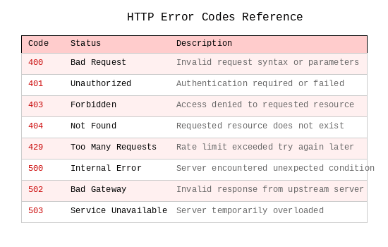

# Images Inside Code Blocks

This document tests that image references inside code blocks are NOT extracted.

## Fenced Code Block

The following should NOT be extracted as an image:

```markdown

```

## Indented Code Block

The following should also NOT be extracted:

    

## Inline Code

References like `` should not be extracted.

## Multiple Code Blocks

```python
# Python code with markdown-like strings
image_ref = ""
print(image_ref)
```

```html
<!-- HTML showing markdown syntax -->
<p>Use  syntax for images</p>
```

## Valid Image Outside Code Blocks

This IS a valid image and SHOULD be extracted:



## Test Expectations

- Parser should extract ONLY the "Error Codes Reference" image above
- All images inside code blocks (fenced, indented, inline) should be ignored
- Expected extracted images: 1 (error-codes.gif)
