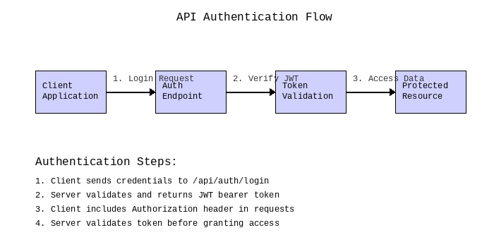

# Grandmother's Homemade Pasta Recipe

A traditional Italian recipe passed down through generations, perfect for
Sunday family dinners.

## Ingredients

- 2 cups all-purpose flour
- 3 large eggs
- 1 tablespoon olive oil
- 1/2 teaspoon salt
- Fresh basil leaves
- Parmesan cheese for serving

## Instructions

1. Create a mound of flour on a clean surface and make a well in the center
2. Crack the eggs into the well, add oil and salt
3. Using a fork, gradually incorporate flour from the edges
4. Knead the dough for 10 minutes until smooth and elastic
5. Let rest covered for 30 minutes
6. Roll out thin and cut into desired shapes
7. Boil in salted water for 2-3 minutes until al dente

## Chef's Notes

The key to perfect pasta is patience during kneading. The dough should be
silky smooth and spring back when pressed. Serve with your favorite sauce
and freshly grated Parmesan.

## Serving Suggestions

Pair with a light Chianti wine and crusty Italian bread. Garnish with fresh
basil and a drizzle of extra virgin olive oil for an authentic taste of Italy.
